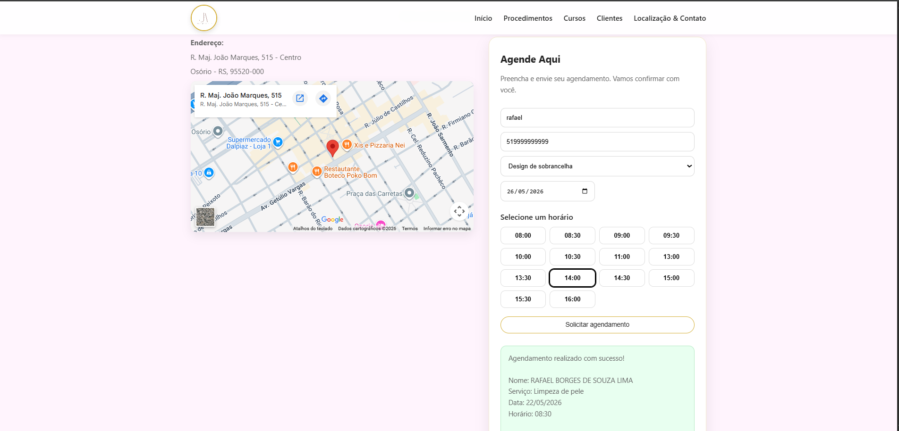
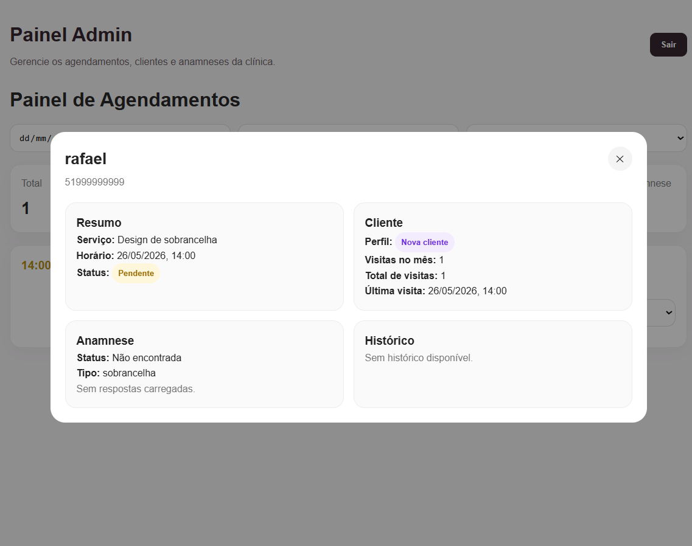

<div align="center">

# JA Clínica — Sistema de Agendamentos Online

**Aplicação fullstack para agendamento de serviços em clínica estética, com painel administrativo, ficha de anamnese e controle de disponibilidade de horários.**

[](https://react.dev)
[](https://vitejs.dev)
[](https://nodejs.org)
[](https://expressjs.com)
[](https://supabase.com)

🌐 **[clinica-ja.onrender.com](https://clinica-ja.onrender.com)**

</div>

---

## Sobre o projeto

O **JA Clínica** é um sistema de agendamento online desenvolvido para clínicas estéticas. O cliente acessa a plataforma, escolhe o serviço desejado, seleciona uma data e visualiza apenas os horários realmente disponíveis — sem conflitos e sem duplo agendamento. Ao finalizar, preenche uma ficha de anamnese vinculada ao serviço.

O administrador acessa um painel protegido por JWT para visualizar, filtrar e gerenciar todos os agendamentos.

---

## Screenshots

| Fluxo de agendamento | Painel administrativo |
|:---:|:---:|
|  |  |

---

## Funcionalidades

### Cliente
- Escolha de serviço com exibição de duração e descrição
- Seleção de data com calendário
- Listagem de horários disponíveis calculados em tempo real
- Cadastro automático de cliente por número de telefone
- Preenchimento de ficha de anamnese vinculada ao serviço agendado

### Administrador
- Login protegido com JWT
- Painel com resumo de agendamentos do dia
- Filtros por data, serviço e status
- Modal de detalhes do cliente com histórico
- Proteção de rota no frontend e validação de token no backend

### Backend
- Validação de conflitos de horário server-side
- Rate limiting e proteção contra ataques comuns (Helmet, HPP)
- Validação de entrada com Zod
- Arquitetura em camadas (Controller → Service → Repository)

---

## Arquitetura

```
clinica_agendamentos/
├── front-end/                  # React + Vite
│   └── src/
│       ├── components/         # Componentes reutilizáveis
│       ├── pages/              # Páginas (Home, Admin, Login)
│       └── lib/                # Configuração de cliente HTTP
│
└── back-end/                   # Node.js + Express
    ├── server.js               # Entry point
    └── src/
        ├── app.js              # Express app, middlewares globais
        ├── config/             # Variáveis de ambiente (Zod)
        ├── routes/             # Definição de rotas
        ├── controllers/        # Recebe requisição, delega ao service
        ├── services/           # Regras de negócio
        ├── repositories/       # Acesso ao Supabase (PostgreSQL)
        ├── schemas/            # Schemas de validação Zod
        ├── middleware/         # Auth JWT, rate limit, error handler
        └── utils/              # Helpers (cálculo de horários, datas)
```

**Fluxo de dados:**  
`React → Express API (REST) → Supabase (PostgreSQL)`

---

## Como rodar localmente

### Pré-requisitos

- Node.js 18+
- Conta no [Supabase](https://supabase.com) com as tabelas criadas

### 1. Clonar o repositório

```bash
git clone https://github.com/Rafael-Borges318/clinica_agendamentos
cd clinica_agendamentos
```

### 2. Configurar variáveis de ambiente do back-end

```bash
cd back-end
cp .env.example .env
# Preencha os valores no .env conforme sua conta Supabase
```

### 3. Instalar dependências e rodar o back-end

```bash
# Na pasta back-end/
npm install
npm run dev
# API disponível em http://localhost:3000
```

### 4. Configurar e rodar o front-end

```bash
cd ../front-end
# Crie um .env com:  VITE_API_URL=http://localhost:3000
npm install
npm run dev
# App disponível em http://localhost:5173
```

---

## Variáveis de ambiente

Veja [back-end/.env.example](back-end/.env.example) para a lista completa de variáveis necessárias.

---

## Deploy

A aplicação está em produção no **Render** (free tier):

🌐 [https://clinica-ja.onrender.com](https://clinica-ja.onrender.com)

> _Nota: por estar no plano gratuito, o servidor pode levar ~30 segundos para acordar na primeira requisição._

---

## Autor

**Rafael Borges de Souza Lima**  
Estudante de Análise e Desenvolvimento de Sistemas  
[](https://linkedin.com/in/rafael-borges-lima)
[](https://github.com/Rafael-Borges318)
